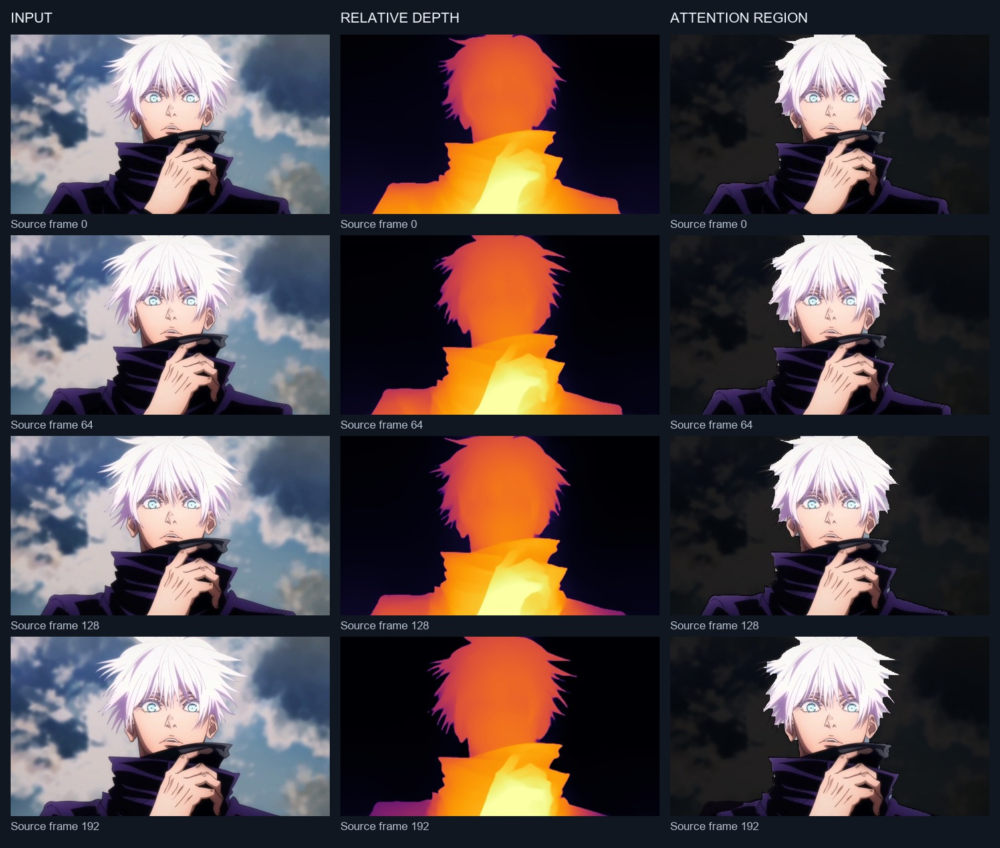

# Anime_DeadFramesRemover(DFR)

**Created by [xyether](https://github.com/XYETHER).**

Remove held frames from anime clips before interpolation. DFR uses a depth map
to focus its motion checks on the foreground, compares the original pixels,
then exports the frames it keeps. Optional **RIFE** interpolation fills the gaps
between those frames.

[](https://colab.research.google.com/github/XYETHER/Anime_DeadFramesRemover-DFR/blob/main/DFR_Colab.ipynb)

## See it in action

All four examples use the same user-supplied Gojo clip and were generated on a
**Tesla T4**. Click a preview to open its MP4. GIFs are reduced-size previews;
the public MP4s are compact **960 × 540** web previews. DFR and RIFE were
processed at the input's 1920 × 1080 resolution before resizing for publication.

| Input clip | Depth map results |
| --- | --- |
| [](https://github.com/XYETHER/Anime_DeadFramesRemover-DFR/raw/refs/heads/main/assets/input.mp4) | [](https://github.com/XYETHER/Anime_DeadFramesRemover-DFR/raw/refs/heads/main/assets/depth.mp4) |
| Original timing. | Relative depth, visualized with warm colors for nearer regions. |

| Input + interpolation | Dead frames removed + interpolation |
| --- | --- |
| [](https://github.com/XYETHER/Anime_DeadFramesRemover-DFR/raw/refs/heads/main/assets/input-interpolated.mp4) | [](https://github.com/XYETHER/Anime_DeadFramesRemover-DFR/raw/refs/heads/main/assets/dfr-interpolated.mp4) |
| RIFE v4.26, 8×, played at 60 FPS. | DFR Type 1 → RIFE v4.26, 8×, played at 60 FPS. |

Both interpolation previews intentionally use slowed playback. They have
different durations because DFR removes frames and retimes the retained frames
to 23.976 FPS. They are not a synchronized comparison at the original timing.
All demo MP4s are silent. GIFs show the first four seconds at 12 FPS.
[DFR output before interpolation](assets/dfr.mp4).

| MP4 | Frames | Playback FPS | Duration |
| --- | ---: | ---: | ---: |
| Input | 256 | ~60 | 4.27 s |
| Depth maps | 256 | 60 | 4.27 s |
| Input + RIFE | 2,041 | 60 | 34.02 s |
| DFR + RIFE | 673 | 60 | 11.22 s |

## What the example shows

The source has **256 frames at approximately 60 FPS**. Type 1 analyses every
third frame: **86 frames analysed, 85 retained**. Of the 171 removed frames,
**170 were skipped before analysis and one was classified as held**.
This is a demonstration of the pipeline, not a benchmark of duplicate-detection
accuracy. The [decision CSV](assets/decisions.csv) records every source frame;
the [T4 report](assets/report.json) includes settings, timings and video metadata.



Left: input. Middle: estimated relative depth. Right: the region used for
motion checks. The dimmed background is only an explanation image; DFR's
video output uses the original full-color frames.

## Run in Colab

1. Open the notebook using the badge above. Choose **Runtime → Change runtime type → T4 GPU**.
2. Run **1. DFR — Setup**. It downloads the pinned Depth Anything V2 Small model and caches it.
3. In **2. DFR — Remove dead frames**, upload a clip, paste a public Google Drive file link, or enter a `/content` file/folder path.
4. Choose **Type 1** or **Type 2**, select NVIDIA H.264/H.265, and run the cell. Download your `_DFR.mp4` file.
5. For interpolation, run the bonus **RIFE SETUP**, then enter the downloaded DFR output's `/content` path in **PROCESS VIDEO**.

For the interpolation comparison above: `interpolation_factor = 8`,
`rife_model = "v4.26"`, `deadframes = "Off"`, `slow_down = "60 fps"`,
`encoder = "h264_nvenc"`. Run the original clip and DFR result separately.
The bonus `deadframes` dropdown is a fixed FPS conversion; it is separate from
DFR's depth-assisted selection. Leave it **Off** when interpolating a DFR output.

| DFR mode | Behaviour |
| --- | --- |
| Type 1 (default) | Analyses every third source frame, then applies the motion selector. More aggressive removal. |
| Type 2 | Analyses every second source frame, then applies the same motion selector. Retains more opportunities for brief motion. |

## How it works

```text
Input clip
   ↓
Type 1/2 frame stepping
   ↓
Depth Anything V2 Small → foreground attention mask
   ↓
Compare original pixels against the last retained frame
   ↓
Keep motion / detected scene cuts; drop held frames
   ↓
Original-resolution, silent MP4 at 23.976 FPS
   ↓ optional
RIFE interpolation
```

Global, local-patch and small high-contrast changes guide the decision.
Unusable depth falls back to a stricter full-frame comparison. The selector
compares against the last retained frame so gradual changes can accumulate.

**Timing matters:** DFR is designed to shorten/retime clips for editing.
It does not preserve source duration, audio sync or variable-rate timing.
Frame stepping can miss brief blinks, fast action and cuts between sampled
frames. Depth estimates on stylized anime can also be imperfect. Review the
result before using it in an edit.

## Run the DFR pipeline locally

Requires a CUDA-capable NVIDIA GPU, a suitable CUDA-enabled PyTorch build,
and FFmpeg/ffprobe on `PATH` with working `h264_nvenc` or `hevc_nvenc`.
SDR input is supported; HDR is rejected. Hardware encoding is required.

```bash
git clone https://github.com/XYETHER/Anime_DeadFramesRemover-DFR.git
cd Anime_DeadFramesRemover-DFR
python -m pip install -r requirements.txt
python -m dfr input.mp4 --type 1 --codec h264_nvenc --output-dir results
```

The Python module exposes the notebook's DFR analysis and encoding core.
Depth weights download on the first run and are cached in `.dfr-cache`.
The notebook provides the optional RIFE workflow. Colab is the verified
end-to-end environment for this release; the local CLI requires your own
working CUDA/NVENC installation.

To reproduce the four MP4 previews inside Colab after cloning the repository:

```bash
python scripts/generate_previews.py /content/your_clip.mp4
```

Results go to `/content/DFR_demo/previews`. This runs Type 1, renders depth maps
for every input frame, and applies RIFE v4.26 8× at 60 FPS to both video paths.
The script keeps full-resolution video renders; the published assets were
resized separately for web viewing.

## Credits and license

DFR was created by **xyether**. It uses
[Depth Anything V2 Small](https://github.com/DepthAnything/Depth-Anything-V2)
for depth and [Practical-RIFE](https://github.com/hzwer/Practical-RIFE)
for optional interpolation.

Project code: [MIT](LICENSE). Third-party software, models and the example anime
footage have separate terms; see [credits and notices](THIRD_PARTY_NOTICES.md).
